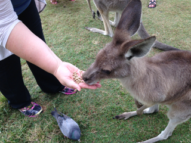
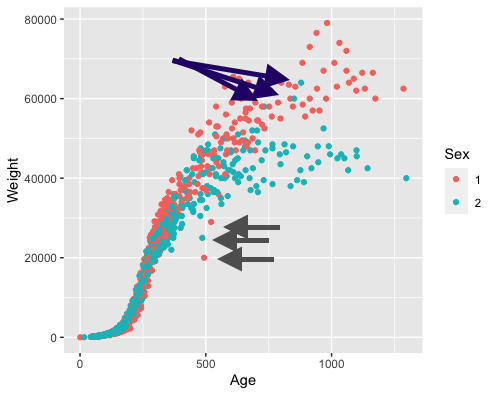

```{r setup, include=FALSE}
knitr::opts_chunk$set(echo = TRUE)
```

## Tammar Wallabies

This is an open book, open note exam. You have 70 mins of time to submit your answers to the questions. 
I expect you to adhere to academic integrity, i.e. all of the work shown is your own. Do not solicit, accept or give any direct or indirect help on the questions from or to anyone. 

Please be aware that during that you will have to sign off on the following statement during the submission process:

> I affirm that the work on this exam is my own and I will not use any outside sources or people to help me nor will I share any part of this exam or my work with others without permission of the instructor.

For the following questions we are going to investigate growth of Tammar Wallabies. [Wallabies](https://en.wikipedia.org/wiki/Wallaby) look like small kangaroos and  are in the same family of marsupials as kangoroos. They are native to Australia and New Guinea. 




The data  was provided by Dr Jeff Wood, CSIRO, Canberra: 
```{r data}
wallabies <- read.table("http://www.statsci.org/data/oz/wallaby.txt", stringsAsFactors = FALSE, sep="\t", header=TRUE)
head(wallabies)
```

Most body measurements are taken in (tenths of) millmeters. 

| Variable 	| Description                               	|   	| Variable 	| Description                  	|
|----------	|-------------------------------------------	|---	|----------	|------------------------------	|
| Anim     	| animal identifier                         	|   	| Arm      	| length of arm                	|
| Sex      	| 1 = male, 2 = female                      	|   	| Leg      	| length of leg                	|
| Loca     	| location of animal                        	|   	| Pes      	| length of foot               	|
| Leng     	| length of animal (tenths of a millimiter) 	|   	| Tail     	| length of tail               	|
| Head     	| length of head                            	|   	| Weight   	| weight (in tenths of a gram) 	|
| Ear      	| length of ear                             	|   	| Age      	| age in days from birth       	|


Provide code for all of your answers.

### Question 1: getting an overview of the data

- How many observations are there in total? 
- The variables `Anim`, `Sex`, and `Loca` should be encoded as factor variables. Make sure they are.
- Which measurements have the largest/fewest numbers of missing values?  Use ggplot2 to draw a scatterplot of length of head by age. Color points by sex. Describe the relationship(s) in three to four sentences. 
- How many different animals were observed? How many non-missing measurements of head length are there on average for each animal?
- Do animals change locations often? Check that *only* animal 125 is observed in two different locations. For animal 125 plot head length by age, color by location. Describe. 
Exclude the likely outlier from further consideration. 
- Plot a barchart of the number of animals in each location (not the number of times an animal was observed there). Order locations from most animals to least.

```{r, warning = FALSE, message=FALSE}
# your code goes here

# don't forget to write comments
```

### Question 2: finding oddities

Consider the visualization below



There are two sets of arrows pointing towards 'odd' values.

- Describe what is 'odd' about the values the grey arrows point to. Identify the animals  with these observations. Filter on them and draw the above plot for just these animals. Describe your finding(s). 
Draw a plot for these animals using age and head length. Compare and describe.

- The blue arrows point to three blue points surrounded by red values.  Identify the animal(s)  with these observations. Draw the above plot of this/these animal(s) in a different color on top of all female wallabies. Are these females just heavy? Draw a similarly structured plot of leg length  by age. Does your previous conclusion hold?

```{r}
# your code goes here
```


### Question 3: Next!

Introduce  variable `N` into the `wallabies` data that consists of the number of times an animal has been observed (regardless of missing values).

- How many animals were observed at least 15 times? 
- Which animal was observed most often? What else do we know about the animal? Describe three features.
- Introduce a variable `Next` into the `wallabies` data that contains the number of days until the next time the animal is observed. For the last observation, include a value of `NA` for `Next`.
- What is the average time (in days) between observations? Plot a histogram of `Next` with a binwidth of one week. Describe the plot in 2-3 sentences. 

```{r}
# Your code goes here
```

